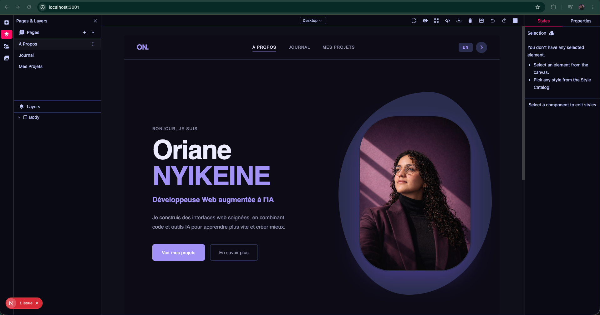

# WebBuilder Studio



---

I spent several months learning Webflow, building with it. Then it became financially out of reach. Rather than stopping there, I started looking into open source alternatives.

That is how I found GrapesJS, a drag & drop visual editor engine I could run directly in VS Code, the tool I use every day, including for Claude Code. Finding out that GrapesJS worked perfectly in an environment I already knew well, that was exactly what I needed.

I decided to turn it into a bespoke tool. Every difficulty I encounter in my workflow becomes the starting point for a new feature. It is entirely shaped around my needs, something I can keep refining indefinitely.

It follows the same logic as Webflow, the same naming conventions, the same Client First structure. But it is entirely mine.

I always start from a first version generated by Claude, based on a reference site or an idea. The result is often solid but generic, AI slop as people call it. That base helps me avoid the blank page and saves a considerable amount of time: I do not have to build each section from scratch. I import that first version into WebBuilder Studio and rework it visually, component by component, until I have something clean and personal.

I built my portfolio with this tool. What you can see in the canvas in the screenshot is my portfolio being edited.

The tool is still in development. I have already built a Client First plugin, a button that automatically generates the correct section structure, and a basic interactions plugin. My ambition is to keep improving it: complex animations with GSAP, a CMS, optimisation and SEO plugins added over time as projects demand.

WebBuilder Studio is not a product for sale. It is a training ground as much as a bespoke working tool. I use it to build sites, to learn how to write clean code, and to understand the mechanics behind the scenes.

---

## Features

- Drag & drop visual editor (GrapesJS Studio SDK)
- Custom dark theme (violet/pink palette)
- Auto-save to a local JSON file via Next.js API
- Client First plugin: one click generates a properly named section structure
- Basic interactions plugin (GSAP animations planned)
- Rich components: tables, Swiper carousels, galleries, accordions, Iconify icons, YouTube videos

## Stack

| Tool | Role |
|------|------|
| Next.js 16 | React framework (App Router) |
| GrapesJS Studio SDK | Visual editor engine |
| TypeScript | Type safety |
| Tailwind CSS 4 | Utility styles |

## Getting started

```bash
git clone https://github.com/oriane-nyikeine/webbuilder-studio.git
cd webbuilder-studio
npm install
npm run dev
```

Open [http://localhost:3000](http://localhost:3000).

> The `DEMO_LOCALHOST_KEY` license key is provided by GrapesJS for local development only.

## Project structure

```
src/
├── app/
│   ├── api/project/     # Save API (GET / POST)
│   ├── layout.tsx
│   └── page.tsx
├── components/
│   ├── StudioEditorWrapper.tsx   # Main editor
│   └── LoadingScreen.tsx
└── plugins/
    ├── clientFirstPlugin.ts      # Client First integration
    └── animationsPlugin.ts       # Basic interactions
data/
└── portfolio.json                # Saved project (git-ignored)
```

---

**Oriane Nyikeine** · [LinkedIn](https://www.linkedin.com/in/oriane-nyikeine) · [GitHub](https://github.com/oriane-nyikeine)
